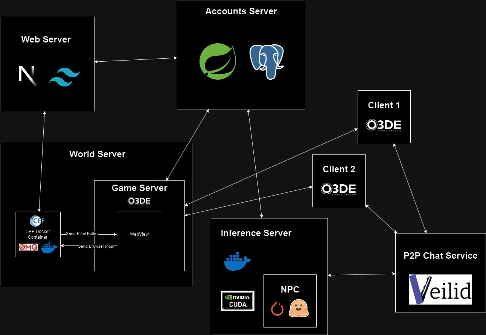

public:: true

- Open Source Proof-of-Concept of what a metaverse would look like that allows users to:
	- Anonymously chat with each other
	- Interact with remote webpages inside the metaverse
	- Use a shared account for multiple services
- All of its dependencies (except CUDA) are open source
- [[Development Environment Setup]]
- ## Architecture
	- 
	- ### Web Server
	  id:: 65cf7153-ee27-4c68-b221-b769601f34a4
	- ### [[World Server]]
	- ### Accounts Server
	- ### Inference Server
	- ### Clients
	- ### P2P Chat Service
- ## Technical Details
	- 
		- If the above isn't rendered (due to a Logseq bug), the requirements and formal specification (in spanish) are located [here](https://github.com/MisterChief53/Metapulse-wiki/blob/master/assets/Documento_Final_1707322895598_0.pdf)
- ## Repositories Quick Links
	- [WebView](https://github.com/MisterChief53/CEF-Docker-O3DE)
	- [Wiki](https://github.com/MisterChief53/Metapulse-wiki)